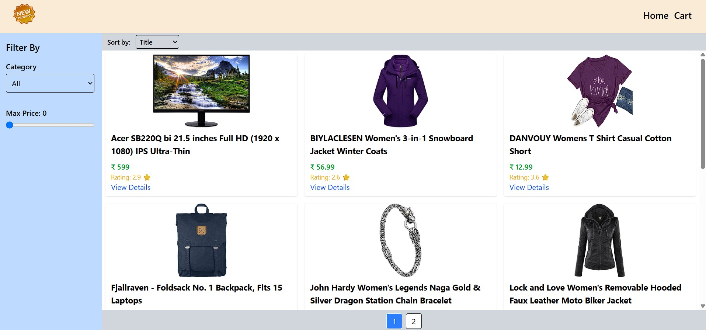
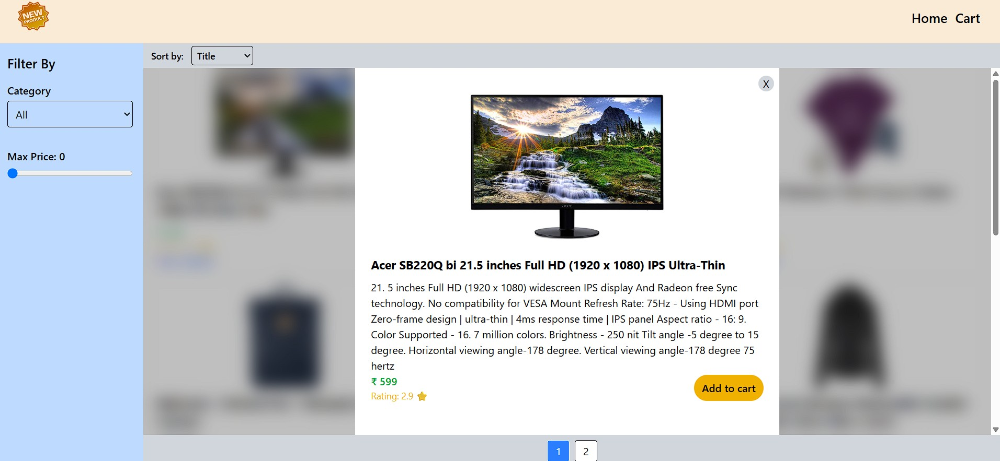
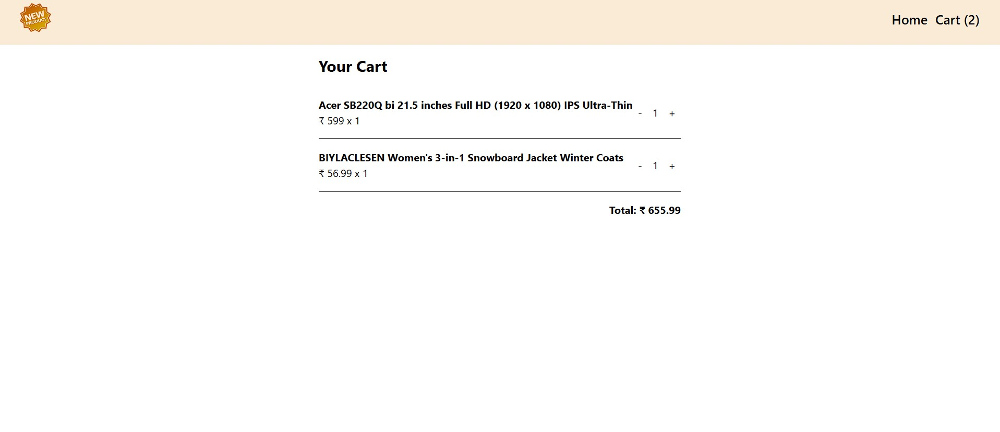

## 🚀 Setup Instructions

Follow the steps below to set up the project locally:

### 1. Clone the Repository

git clone https://github.com/prash286/product_showcase.git
cd product_showcase

2)npm install
3)npm run dev

## 📸 Screenshots

### 🏠 Home Page

### 📦 Product Details

### 🧭 Cart details

